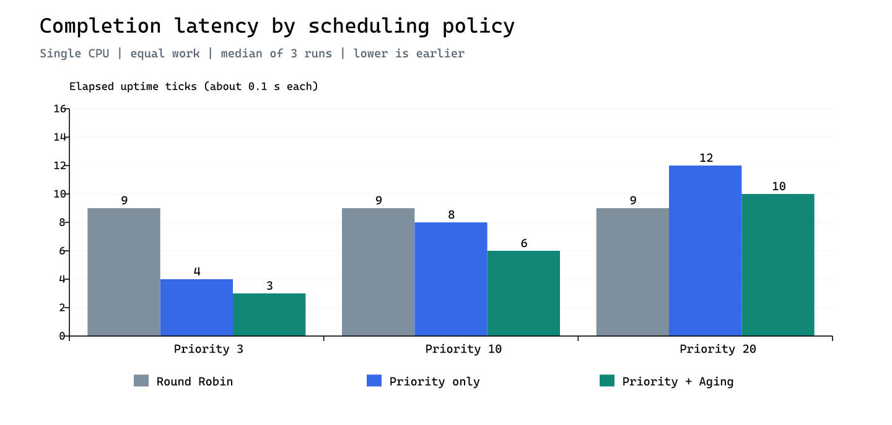
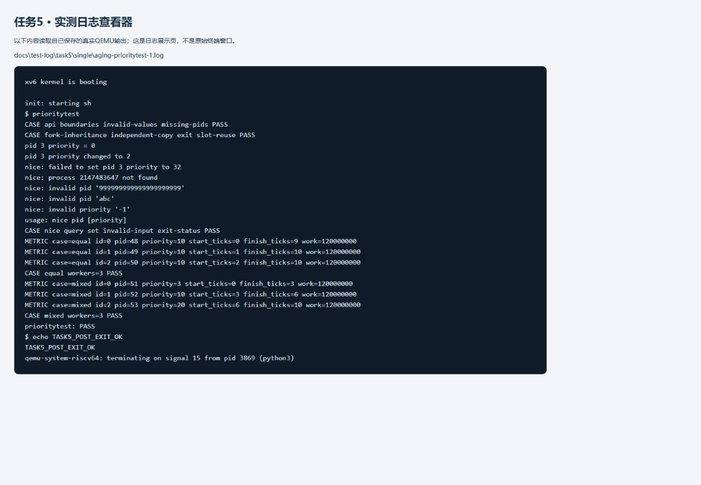
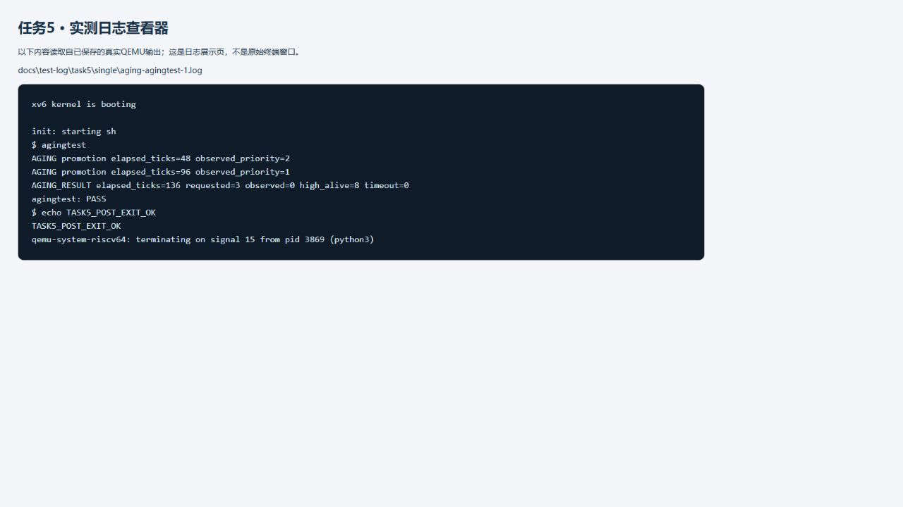
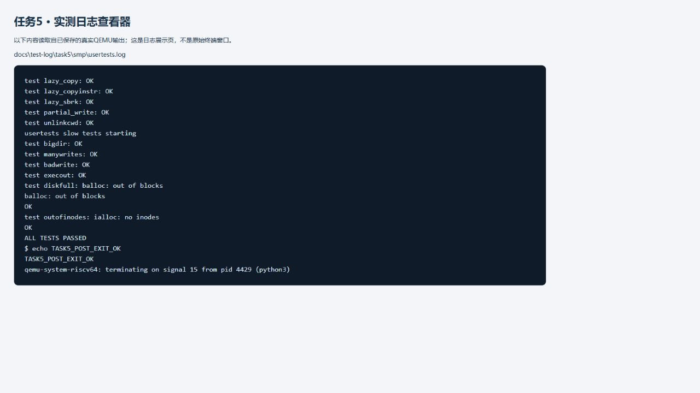

# 任务5测试报告

实测日期：2026-09-20；报告整理日期：2026-09-29。

本报告提取既有答辩材料中的真实运行结果、实测日志展示及真实调试记录，作为测试模块的独立证据归档。表格、图表和日志均来自已保存的运行结果，本次没有重新执行QEMU实验或生成新的性能数据。

**版本范围**：原始日志对应`7c22218`与`a2e5630`，源码提交和逐文件哈希以各组`results.json`为准。测试源码随后以`0851624`合入仓库；截至本次整理，main为`093d9f3`，包含`8a43151`的宿主平台信息兼容修复。本报告不把9月20日的数据当作这些后续修改的重新验收结果，也不改写原始日志中的版本信息。

## 一、真实运行结果

本机真实环境：Windows宿主的Docker Linux容器，Debian forky/sid，QEMU 11.1.0，riscv64-linux-gnu-gcc 16.2.0；每轮启动独立文件系统副本，单核、三核及对照实验顺序执行。每个正式负载重复3次。源码提交和逐文件SHA-256保存在各组results.json中：单核/三核基于`7c22218`，对照基于`a2e5630`，三组使用相同的用户态测试与生产内核代码。

正式共30次guest执行：26次PASS，4次符合判据的EXPECTED_FAIL，0次意外失败。单核`usertests -q`通过（宿主约105秒），三核完整`usertests`通过（约400秒），包含慢速测试。每项都通过了返回shell后的命令检查。

远程独立复现：[GitHub Actions任务5测试](https://github.com/Aphrodite-deepblue/os-design-practice/actions/runs/35515907723)在提交`a2e5630`上完成，single、smp、compare三个任务均为success，实际使用Ubuntu24.04环境，并上传对应原始日志。本节定量表统一采用本机一组数据，不混合两个环境的测量结果。

| 数据集 | PASS | EXPECTED_FAIL | FAIL | 总体通过 |
|---|---:|---:|---:|---|
| single | 7 | 0 | 0 | True |
| smp | 7 | 0 | 0 | True |
| compare | 12 | 4 | 0 | True |

单核混合优先级负载，统一释放起点；单位为 uptime tick。

| 策略 | 优先级 | n | 开始延迟中位数 | 完成历时中位数 | 完成历时范围 |
|---|---:|---:|---:|---:|---|
| rr | 3 | 3 | 0 | 9 | 9–9 |
| rr | 10 | 3 | 1 | 9 | 9–9 |
| rr | 20 | 3 | 2 | 9 | 9–9 |
| priority | 3 | 3 | 0 | 4 | 4–4 |
| priority | 10 | 3 | 4 | 8 | 8–9 |
| priority | 20 | 3 | 8 | 12 | 12–14 |
| aging | 3 | 3 | 0 | 3 | 3–3 |
| aging | 10 | 3 | 3 | 6 | 6–7 |
| aging | 20 | 3 | 6 | 10 | 9–10 |

| 数据集/策略 | 轮次 | Aging结果 | 获得运行/超时 tick | 实测优先级 | 高优先级存活数 |
|---|---:|---|---:|---:|---:|
| single/aging | 1 | PASS | 136 | 0 | 8 |
| single/aging | 2 | PASS | 136 | 0 | 8 |
| single/aging | 3 | PASS | 136 | 0 | 8 |
| smp/aging | 1 | PASS | 47 | 0 | 8 |
| smp/aging | 2 | PASS | 47 | 0 | 8 |
| smp/aging | 3 | PASS | 46 | 0 | 8 |
| compare/priority | 1 | EXPECTED_FAIL | 256 | 3 | 8 |
| compare/priority | 2 | EXPECTED_FAIL | 256 | 3 | 8 |
| compare/priority | 3 | EXPECTED_FAIL | 256 | 3 | 8 |
| compare/aging | 1 | PASS | 136 | 0 | 8 |
| compare/aging | 2 | PASS | 136 | 0 | 8 |
| compare/aging | 3 | PASS | 136 | 0 | 8 |

高优先级3的完成历时中位数在RR中为9 tick，静态优先级中为4 tick，Aging集成版本中为3 tick；体现了优先级调度对高优先级工作的服务优势。短负载中两种优先级版本都维持依优先级运行，不能将它们之间的数值差异解释为“Aging提高吞吐量”：实验轮次少、执行顺序固定，宿主速度波动及tick取整均会影响结果。

持续竞争时，单核Aging三轮均在136 tick观察到低优先级运行，三核为46～47 tick。禁用Aging的三轮均在256 tick报告超时，优先级仍为3，八个竞争者仍存在。超时阈值为250，但观察进程也要等待调度，因此实际报告时刻稍晚。多核更早提升与按调度扫描累计的实现相符，不能直接推导为固定倍数的性能提升。

原始材料：[汇总表](test-log/task5/summary.md)、[单核结果](test-log/task5/single/results.json)、[三核结果](test-log/task5/smp/results.json)、[对照结果](test-log/task5/compare/results.json)。同目录包含构建日志、每次QEMU原始输出和CSV。development目录保留首次失败与修复后的冒烟测试。图表由这些实测数据生成，不是终端截图。

### 指标含义和分析边界

- `start_ticks`：从统一释放到子进程开始计算的延迟。
- `finish_ticks`：从统一释放到子进程计算完成的历时；不包含之后打印、回收的全部开销。
- 二者来自`uptime()`，本内核定时器约0.1秒一个tick。使用tick原值进行比较，避免伪精确到毫秒。
- `wait_ticks`是调度扫描次数的累计，和上述计时指标不是同一个量，多CPU会影响累计速度。
- 三策略对照仅替换调度部分并保留接口，属于受控策略比较；不能说运行了三个完全独立的原版系统。
- 优先级调度主要改变谁先得到服务，不保证整体吞吐量提高；有限重复测试也不能证明任意负载的永久无饥饿。
- Aging目前直接修改priority，运行后不恢复“基础优先级”；长期运行后各进程可能趋近0。这是当前实现的局限，未擅自替其他成员扩展架构。

## 二、实测日志展示

实测日志展示截图如下。截图来自保存的QEMU日志查看页，页面明确标注来源，未冒充原始终端窗口；完整原文以对应`.log`文件为准。

对应原文：[prioritytest第一轮](test-log/task5/single/aging-prioritytest-1.log)、[agingtest第一轮](test-log/task5/single/aging-agingtest-1.log)、[三核完整usertests](test-log/task5/smp/usertests.log)。日志末尾的QEMU signal 15出现在退出后检查完成之后，是运行器关闭虚拟机的记录；应结合PASS及`TASK5_POST_EXIT_OK`判断。

## 三、真实调试记录

首次运行暴露出负载太短：1200万次计算中，三个进程在1个tick内就完成，无法稳定体现时间片竞争。将负载调为1.2亿次，并保留至少2tick的检测，防止在更快环境中产生无意义的通过。

同一轮还发现宿主按串口数据块而非完整行识别失败：读到`FAIL`立即退出，导致后面的原因被截断。改为等待换行后再判断，并对负面对照核对具体原因。两项均属于本测试模块的问题，保留在本报告与随附的初期日志中；没有把它们说成其他成员的内核错误。

初次环境准备还遇到Docker Hub连接失败，改用已有本地容器基础镜像安装工具。当时使用的Debian发行版将RISC-V QEMU拆为`qemu-system-riscv`，补装后才具备运行条件。Ubuntu24.04的CI环境与本机Debian实际环境分别记录，不混称同一环境。

调试证据：[初次负载不足与失败原因截断](test-log/task5/development/smoke2/aging-prioritytest-1.log)、[修复后的冒烟测试](test-log/task5/development/smoke3/aging-prioritytest-1.log)、[RR负面对照完整失败原因](test-log/task5/compare/rr-order-negative.log)、[禁用Aging后的超时证据](test-log/task5/compare/priority-agingtest-1.log)。这些初期尝试单独归档，不计入正式30次guest执行的通过统计。

## 四、证据索引与整理说明

原始日志、构建输出、CSV及JSON位于`docs/test-log/task5/`，图表及日志展示截图位于`docs/images/task5/`。[SHA-256清单](test-log/task5/SHA256.json)用于核对归档文件字节。清单路径使用原Windows记录中的反斜杠，跨平台校验时可转换为正斜杠；原始日志内容不作排版修改。

本报告由Codex（GPT-6）协助从既有材料提取、调整章节并核对日志。只整理已有实测事实，未将人工设定参数或AI生成内容冒充测量结果。汇报讲稿、个人贡献问答及整份答辩报告不属于本次仓库提交。
